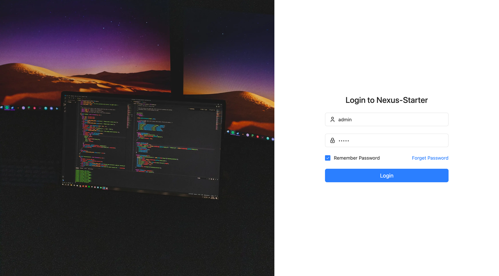
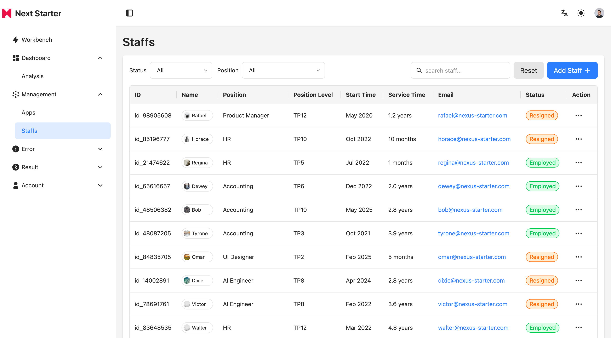
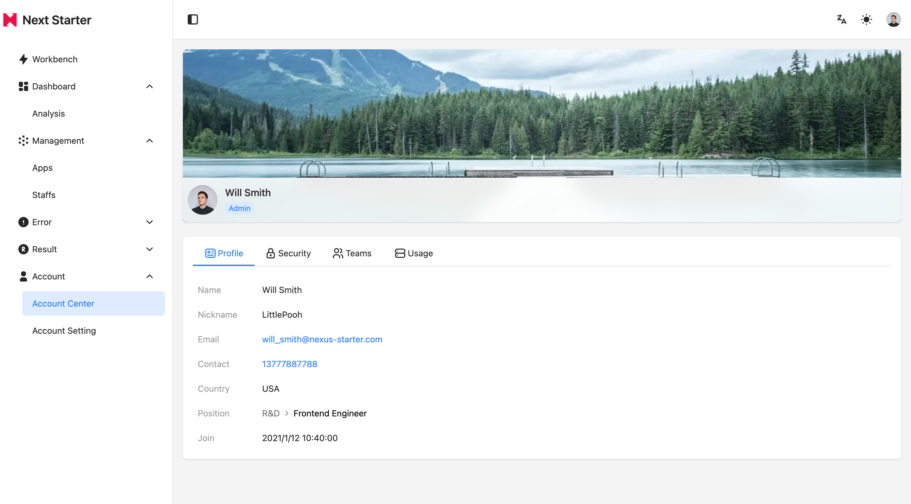

# Nexus-Starter

中文 | [English](README.md)

Nexus-Starter 是一个基于[Nexus-Kit](https://github.com/CiroLee/nexus-kit) and [Vite](https://vite.dev/)构建的现代化管理后台模板项目。

## 预览

[预览地址](https://nexus-starter.netlify.app/)








## 技术栈

- 前端框架: React19 + Typescript
- 构建工具: [Vite](https://vite.dev/)
- UI组件库：[Nexus-Kit](https://github.com/CiroLee/nexus-kit)(基于Radix-UI和tailwindcss v4)
- 状态管理: [Zustand](https://github.com/pmndrs/zustand)
- mock数据: [tiny-lorem](https://github.com/CiroLee/tiny-lorem)(中文友好的轻量mock数据库)
- 路由: [React Router(v7)](https://reactrouter.com/)
- 国际化: [react-i18next](https://react.i18next.com/)
- 表单处理: [react-hook-form](https://react-hook-form.com/)
- 图表：[reaviz](https://github.com/reaviz/reaviz)
- 代码质量: Eslint + Prettier + Husky

## 快速开始

1. 获取代码

```bash
git clone https://github.com/CiroLee/nexus-starter.git
```

2. 安装依赖

```bash
pnpm install
```

3. 启动项目

```bash
pnpm run dev
```

4. 构建项目

```bash
pnpm run build
```

## 许可证

本项目采用 [MIT](LICENSE) License。
