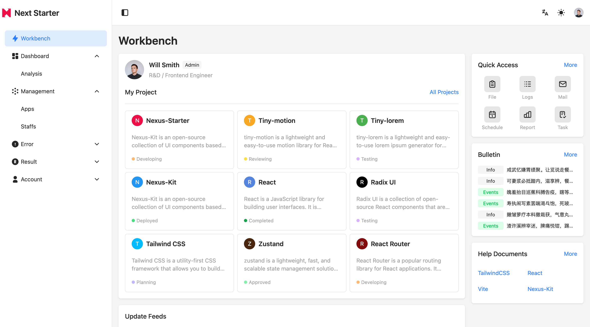

# Nexus-Starter

English | [中文](README-ZH.md)

Nexus-Starter is a modern admin template project built with [Nexus-Kit](https://github.com/CiroLee/nexus-kit) and [Vite](https://vite.dev/).

## Preview

[preview site](https://nexus-starter.netlify.app/)





## Tech Stack

- Frontend Framework: React19 + TypeScript
- Build Tool: Vite
- UI Component Library: [Nexus-Kit](https://github.com/CiroLee/nexus-kit) (based on Radix-UI and TailwindCSS v4)
- State Management: Zustand
- Mock Data: [tiny-lorem](https://github.com/CiroLee/tiny-lorem) (a lightweight mock database friendly to Chinese)
- Routing: React Router v7
- Internationalization: react-i18next
- Form Handling: react-hook-form
- Charts: [reaviz](https://github.com/reaviz/reaviz)
- Code Quality: ESLint + Prettier + Husky

## Quick Start

1. Get the code

```bash
git clone https://github.com/CiroLee/nexus-starter.git
```

2. Install dependencies

```bash
pnpm install
```

3. Run the project

```bash
pnpm run dev
```

4. Build the project

```bash
pnpm run build
```

## License

[MIT](LICENSE)
